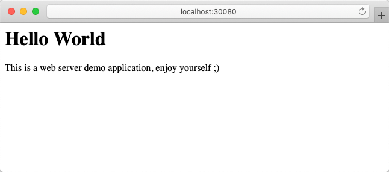

# demo-nodejs-webserver

A demo web server in NodeJS

## Quick Start

## Play with Kubernetes

### Build this demo docker image

```shell
$ make build
docker build -t demo-node-webserver:1.0 .
Sending build context to Docker daemon  113.2kB
Step 1/6 : FROM node:14
 ---> e00884c768d7
Step 2/6 : MAINTAINER Yuanzhen Zhou <szrednick@gmail.com>
 ---> Running in ebb0aa388325
Removing intermediate container ebb0aa388325
 ---> 70a8d70d02fe
Step 3/6 : WORKDIR /app
 ---> Running in 872267a476e9
Removing intermediate container 872267a476e9
 ---> 06275bdd8b73
Step 4/6 : ADD . /app
 ---> 9f8c83ed246a
Step 5/6 : RUN npm install
 ---> Running in 6e16386720e9
npm WARN kubernetes-node-app@1.0.0 No repository field.

added 50 packages from 37 contributors and audited 50 packages in 6.15s
found 0 vulnerabilities

Removing intermediate container 6e16386720e9
 ---> e3bf6da098b8
Step 6/6 : CMD node webserver.js
 ---> Running in 92d24f31adbd
Removing intermediate container 92d24f31adbd
 ---> 3455d0c88c3a
Successfully built 3455d0c88c3a
Successfully tagged demo-node-webserver:1.0
```

### Deploy this demo Web service to Kubernetes

```shell
$ make k8s-deploy
kubectl apply -f deployment.yaml
service/websrv-demo created
deployment.apps/websrv-deploy created
```

### Play and Test our K8S environment

```shell

$ kubectl get services
NAME          TYPE        CLUSTER-IP       EXTERNAL-IP   PORT(S)          AGE
kubernetes    ClusterIP   10.96.0.1        <none>        443/TCP          140m
websrv-demo   NodePort    10.111.193.238   <none>        8888:30080/TCP   2m18s

$ kubectl get pods
NAME                             READY   STATUS    RESTARTS   AGE
websrv-deploy-79d6d6876c-6b6wf   1/1     Running   0          2m31s
websrv-deploy-79d6d6876c-cdxvv   1/1     Running   0          2m31s

$ curl -L http://localhost:30080
<h1>Hello World</h1><p>This is a web server demo application, enjoy yourself ;)</p>

# ( If you are using macOS you can go ahead with this command... )
$ open http://localhost:30080
```



### Delete this deployment in K8S environment

```shell
$ make k8s-delete
kubectl delete -f deployment.yaml
service "websrv-demo" deleted
deployment.apps "websrv-deploy" deleted
```

## Manual Way

```shell
echo "Run docker image in K8S"
$ kubectl run --image=demo-node-webserver:1.0 demo-webserver

echo "Check the K8S pods"
$ kubectl get pods
NAME                              READY   STATUS    RESTARTS   AGE
demo-webserver-7dd7d44b44-qlrlw   1/1     Running   0          45s

echo "Forward Port"
$ kubectl port-forward demo-webserver-7dd7d44b44-qlrlw 18888:8888
Forwarding from 127.0.0.1:18888 -> 8888
Forwarding from [::1]:18888 -> 8888

echo "Check our service"
$ curl -L http://localhost:18888
<h1>Hello World</h1><p>This is a web server demo application, enjoy yourself ;)</p>

# OR ...
$ open http://localhost:18888 -a safari

echo "Expose"
$ kubectl expose deployment.apps/demo-webserver --port 8888 --type=NodePort
service/demo-webserver exposed

echo "Check the expose port"
$ kubectl get services
NAME             TYPE        CLUSTER-IP   EXTERNAL-IP   PORT(S)          AGE
demo-webserver   NodePort    10.99.7.33   <none>        8888:30270/TCP   29s
kubernetes       ClusterIP   10.96.0.1    <none>        443/TCP          174m

echo "Check with our exposec service"
$ curl -L http://localhost:30270
$ open http://localhost:30270 -a safari

echo "Cleanup"
$ kubectl delete service/demo-webserver

echo "Double check"
$ kubectl get all
NAME                 TYPE        CLUSTER-IP   EXTERNAL-IP   PORT(S)   AGE
service/kubernetes   ClusterIP   10.96.0.1    <none>        443/TCP   179m

```


**Enjoy!**
